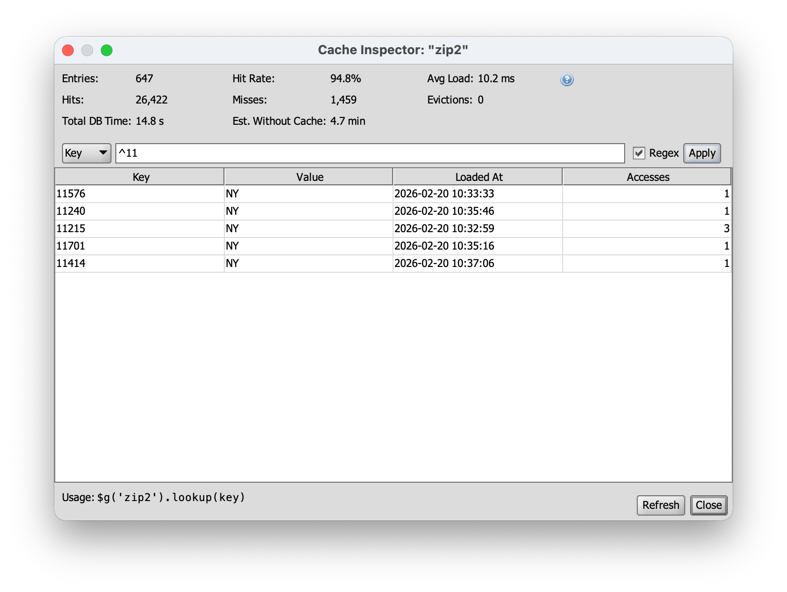

# OIE Cache Manager

A plugin for [Open Integration Engine](https://github.com/nextgenhealthcare/connect) that provides fast in-memory key-value lookups against external databases using Google Guava's LoadingCache and HikariCP connection pooling.

<p align="center">
  
</p>

## Features

- **Lazy per-key loading** — data is fetched from the database on first lookup, then served from memory
- **Automatic eviction** — configurable max size and time-based expiration
- **HikariCP connection pooling** — bounded concurrent connections per cache to prevent connection storms
- **Admin UI** — create, edit, duplicate, enable/disable, and delete cache definitions from the OIE Administrator
- **Cache Inspector** — view hit rates, memory usage, entry counts, and browse cached data
- **REST API** — full CRUD and statistics endpoints with OpenAPI annotations
- **Password encryption** — database credentials encrypted at rest using OIE's built-in encryptor
- **Event logging** — cache operations logged to the OIE event system

## Requirements

- Open Integration Engine 4.5.2+
- Java 17+

## Installation

1. Download the latest `oie-cache-manager-<version>.zip` from the [Releases](https://github.com/diridium-com/oie-cache-manager/releases) page
2. In OIE Administrator, go to **Settings > Extensions** and click **Install Extension**
3. Select the ZIP file and restart the server
4. Verify the **Cache Manager** tab appears under **Settings**

## Usage

Define a cache in the admin UI pointing at your external database, then look it up from any channel:

```javascript
var state = $g('zip2').lookup(zip);
```

The first call for a given key queries the database. Subsequent calls return from memory.

## Building from Source

```bash
mvn clean package
```

The installable plugin ZIP is produced at:

```
package/target/oie-cache-manager-<version>.zip
```

To build with JAR signing enabled (requires a PKCS#11 token):

```bash
mvn clean package -Psigning
```

## Documentation

See the [Wiki](https://github.com/diridium-com/oie-cache-manager/wiki) for full documentation:

- [Getting Started](https://github.com/diridium-com/oie-cache-manager/wiki/Getting-Started)
- [Managing Caches](https://github.com/diridium-com/oie-cache-manager/wiki/Managing-Caches)
- [Cache Inspector](https://github.com/diridium-com/oie-cache-manager/wiki/Cache-Inspector)
- [Using Caches in Channels](https://github.com/diridium-com/oie-cache-manager/wiki/Using-Caches-in-Channels)
- [REST API](https://github.com/diridium-com/oie-cache-manager/wiki/REST-API)
- [Troubleshooting](https://github.com/diridium-com/oie-cache-manager/wiki/Troubleshooting)
- [Security Considerations](https://github.com/diridium-com/oie-cache-manager/wiki/Security-Considerations)

## License

[Mozilla Public License 2.0](LICENSE)
